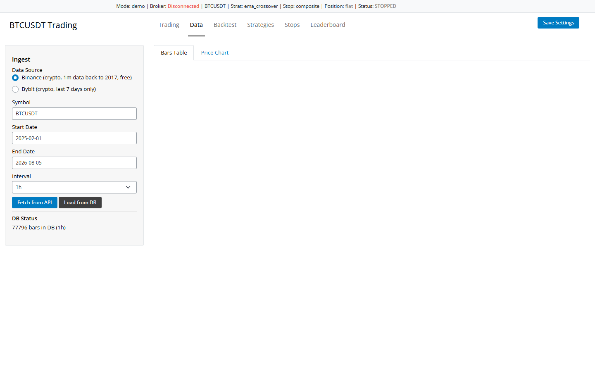
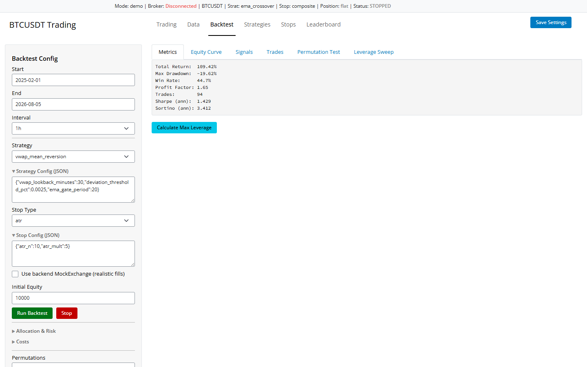
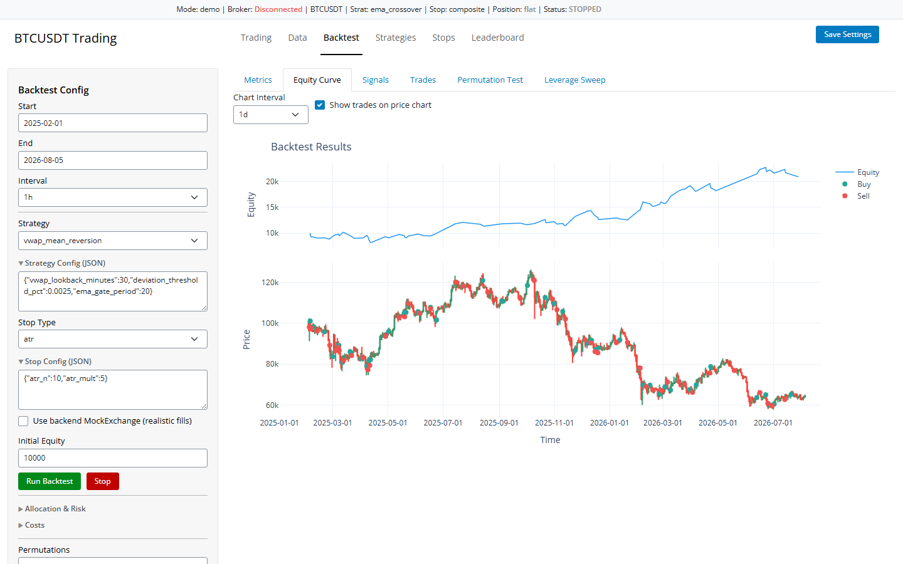
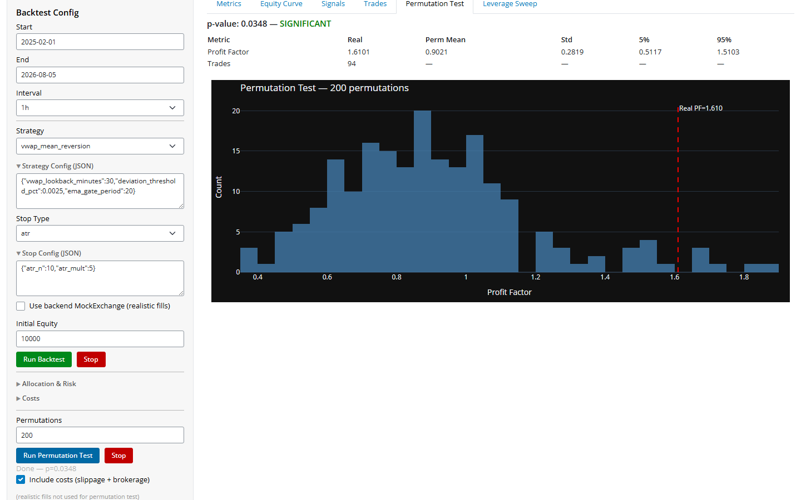
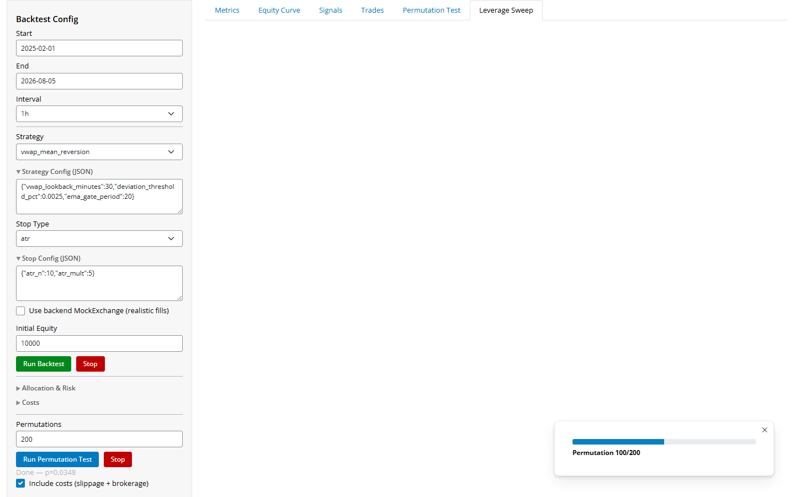
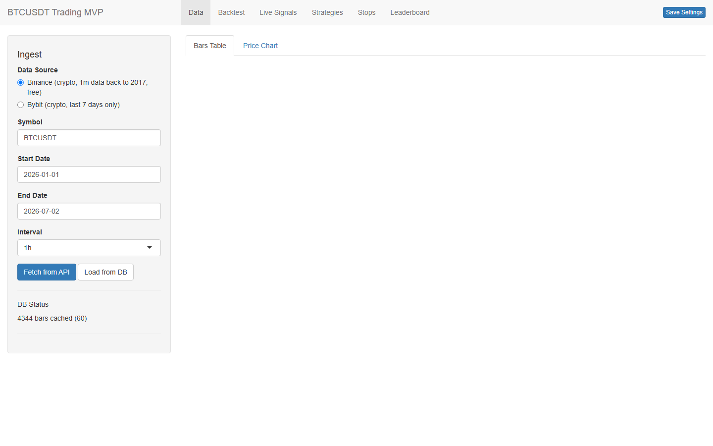
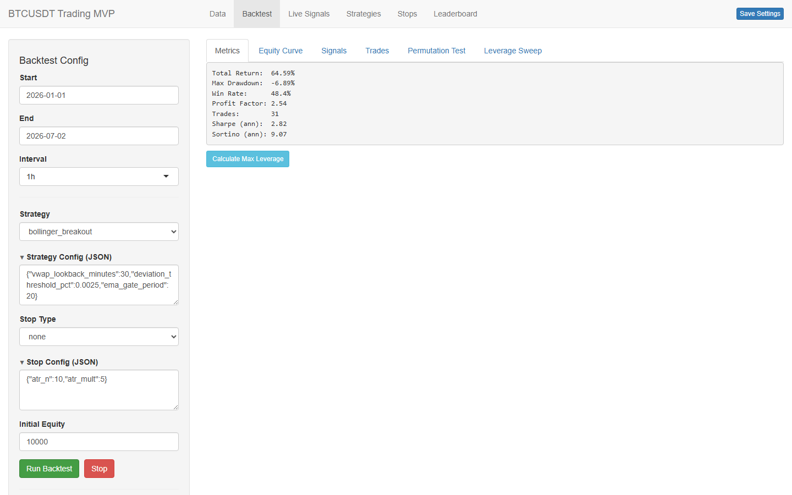
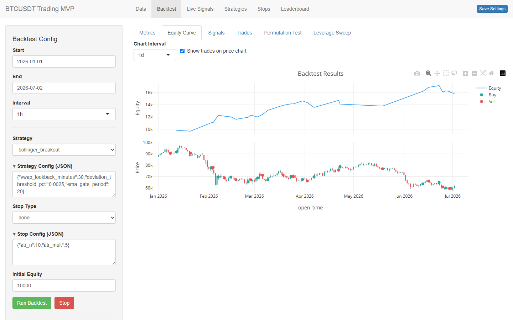
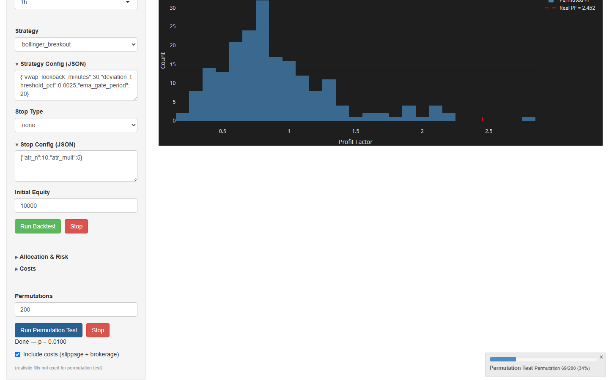

# BTCUSDT Trading Dashboards

Two research-grade paper-trading dashboards for BTCUSDT, built in parallel in
Shiny for Python and Shiny for R. Both apps share the same strategy and
stop-loss logic so that results are reproducible across runtimes.

This repository is a public showcase. The source code lives in two private
repositories:

- `trading-python`: the Shiny for Python app
- `trading-r`: the Shiny for R app

The screenshots below come from the running applications.

## Feature overview

Both apps expose the same six workspaces through a tabbed interface.

- **Data.** Ingest historical klines from Binance or Bybit with gap-filling,
  resample on the fly, and view candlesticks that auto-decimate on large ranges.
- **Backtest.** Run any of 12 built-in strategies with a parameter grid search.
  Costs model slippage, brokerage, funding rates, and isolated-margin
  liquidation. A permutation test checks whether results beat chance.
- **Live signals.** A poller fetches the latest closed candle, runs the
  strategy, and paper-trades against a broker. Manual trades and a flatten
  action are available.
- **Strategies.** Edit strategy code, parameters, and leaderboard grids.
  Strategies auto-discover from a folder, so new ones load without a restart.
- **Stops.** Edit and configure 7 stop-loss types. Stops reuse the same code
  as the strategy layer and support parameter grids.
- **Leaderboard.** Rank many strategy and stop combinations in parallel.
  Results are sortable and exportable, with profit factor color-coded.

Backtests and live polling apply the same fill, leverage, and liquidation
rules, so a strategy's paper performance matches its backtested performance.
The stop-loss manager runs per bar and per tick, writes open trades to SQLite,
and reconciles against the batch stop logic.

## Screenshots

### Shiny for Python

Data ingestion with candlestick chart (1h interval):

Backtest metrics (vwap_mean_reversion + ATR stop, 2025-02 to 2026-08):

Equity curve:

Permutation test (200 permutations):

Leverage sweep:

### Shiny for R

Data ingestion (1h interval):

Backtest metrics:

Equity curve:

Permutation test:

## Cross-runtime parity

The two implementations produce identical signal counts across verified regime
windows. Indicator warm-up, ATR smoothing, and row ordering are aligned so the
same strategy and parameters yield the same trades in either app. The stop
modules use the same algorithm in both languages and pass a shared set of
reconciliation tests.

## Tech stack

| App | UI | Storage | Broker |
|-----|----|---------|--------|
| Python | Shiny for Python, Plotly | Parquet, SQLite | Bybit V5 via ccxt |
| R | Shiny, Plotly WebGL, DT | SQLite | Bybit V5, Binance REST |

## Source

The source is not published.